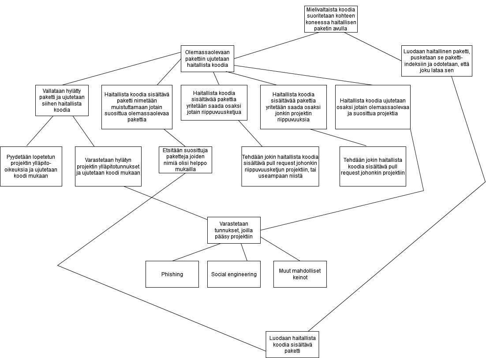

Käsittelen tässä tehtäväsarjassa tarkasteltavia asioita ainakin
Pythonin näkökulmasta, mutta saatan myös joissain tehtävissä käsitellä
lisäksi PHP:ta.

## 1)

Pythonissa olen itse käyttänyt tähän mennessä eniten Poetrya sekä PIPiä, mutta niiden lisäksi tiedän ainakin myös Condan, jota en ole vielä toistaiseksi tarvinnut. Poetry ja PIP käyttävät PyPiä, eli The Python Package Indexia, josta työkalut noutavat riippuvuudet. Tätä kirjoittaessa PyPissä on sivuston itsenä mukaan yli 370 000 projektia. 
Conda puolestaan taitaa käyttää ensisijaisesti Anacondan pakettivarastoa, jonne on valikoitu pääasiassa datatieteiden parissa työskenteleville tärkeitä paketteja, mutta myös Condalla on mahdollista asentaa paketteja käyttäen PyPiä lähteenään.
Tällaisessa tapauksessa, jossa saatavilla olevia paketteja valitaan erikseen, saattaa niiden asentaminen olla aavistuksen turvallisempaa, sillä tällöin voisi ainakin herkästi olettaa, että valikoituja paketteja katselmoitaisiin jollain tavalla. Tähän ei kuitenkaan mielestäni sovi silti ns. ”tuudittautua”.

PHP:ssa puolestaan olen käyttänyt lähinnä Composeria riippuvuuksien hallintaan ja sitäkin vasta hyvin vähän. PHP:lle löytyy myös PEAR, mutta se toimii jo hieman eri tavalla, mitä kaikki muut tähän asti mainitsemani, joten en käsittele sitä sen enempää.
Composer noutaa paketit pakettivarastosta nimeltään Packagist, jossa on tätä kirjoittaessa yli 340 000 pakettia.

Hiljattain olen aloittanut myös Noden (ja Reactin) opiskelun, jonka kanssa käytetään npm-pakettimanageria ja sen pakettivarasto on ylittänyt miljoonan paketin rajan jo kesällä 2019.

## 2)

Pythonilla ei kovinkaan, lähinnä riittää rekisteröityä PyPiin ja sen jälkeen ladata oma pakettinsa sinne muiden saataville. Python Packaging Authority, PyPA, tarjoaa hyvän dokumentaation, jossa neuvotaan vaihe vaiheelta oman paketin luominen ja paketointi, sekä sen lataaminen pakettivarastoon. Ohjeessa paketti ladataan ensin harjoitteluun tarkoitettuun testi-indeksiin, TestPyPi:in, jotta prosessia voi kokeilla ja harjoitella aivan rauhassa.
Näin ollen siis aivan kuka tahansa voi ladata oman pakettinsa muiden saataville, joten mahdollisen hyökkääjän haitallisen paketin lataamiselle palveluun ei ole ainakaan tässä vaiheessa minkäänlaisia esteitä.

PHP:n Packagist toimii hyvin samalla tavoin, vaikkakaan sille ei ole tarjolla aivan yhtä kattavaa ohjeistusta, mitä PyPille löytyy. Packagistin etusivulla löytyy kuitenkin ihan selkeät ohjeet siitä, kuinka paketti tulee kasailla ja lopulta ladata Packagistiin. Myös tässä tapauksessa siis aivan kuka tahansa voi ladata oman pakettinsa muiden saataville. Pakettia ladatessa Packagistiin tulee sille antaa URL julkiseen repositorioon, toisin kuin PyPissä ilmeisesti riittää antaa URL metadatan joukossa, jolloin mikäli oikein ymmärsin, ei se ole aivan välttämätöntä.

Niin ikään myös npm:n tapauksessa prosessi vaikuttaa olevan hyvin samanlainen kun PHP:n ja Pythonin tapauksissa. 

Yhteenvetona siis todettakoon, ettei pakettien lisääminen muiden saataville ole vaikeaa, vaan päin vastoin melko suoraviivaista ja helppoa, jolloin ei tarvitsisi siltä osin olla edes kovinkaan taitava rosmo, mikäli haluaisi haitallista koodia sisältäviä paketteja näihin palveluihin ladata.

## 3)

Ei tarvitse edes googlata, kun ainakin npm:n tapauksesta tulee välittömästi mieleen melko tuore tapaus, jossa kehittäjä osoitti tukensa Ukrainalle ja viritteli pakettiinsa koodia, joka pyyhki venäläisistä sekä valko-venäläisistä koneista levyt sileiksi. Kehittäjän paketti oli muistaakseni Vue.js:n riippuvuutena, joten sillä lienee oletettavasti ollut ihan hyvä levikki siis.
Samoin moni saattaa olla kuullut left-padista, jossa pähkinänkuoressa eräs kehittäjä riitaantui npm:n kanssa heidän pakotettuaan kehittäjän vaihtamaan projektinsa nimeä ja tämän seurauksena kehittäjä veti kaikki pakettinsa pois npm:n pakettivarastosta. Tämän seurauksena suunnilleen koko maailman jäsä-applikaatiot hajosivat, sillä yksi paketeista oli mukana sellaisissa riippuvuuksissa, jotai käytti mm. React. 
Jälkimmäinen tapaus ei varsinaisesti ole sinänsä hyökkäys, mutta ensimmäisen voinee sellaiseksi laskea. Riittäköön tämä npm:n osalta.

Kun sitten alkaa googlaamaan asiaa, vähemmän yllättäen hyökkäyksiä löytyy myös PyPin osalta. Ensimmäisten hakutulosten joukossa on esimerkiksi viime marraskuussa julkaistu artikkeli, jossa kerrotaan tietoturvatutkijoiden löytäneen PyPistä 11 uutta haitallista pakettia, joita oli ladattu jo yli 41 tuhatta kertaa. Samaisessa artikkelissa kerrotaan myös vuosina 2016 ja 2017 tapahtuneista hyökkäyksistä, joissa ensimmäisessä on hyödynnetty luentotallenteissakin esitettyä keinoa, nimeltään ”typosquatting”. Toinen artikkeli jatkaa hyvinkin samoilla linjoilla ja mainitsee artikkelin aluksi esimerkkinä riippuvuussuhdehyökkäyksistä SolarWindin tapauksen, josta varmasti on kuullut jokainen, joka vähääkään seuraa tietoturvauutisia. Artikkeli kertoo kolmesta eri haavoittuvuudesta, jotka oli löydetty PyPistä ja neuvoo käyttämään versioihin sidottuja riippuvuuksia ehkäisemään pakettien automaattisen päivittämisen myötä herkästi mukana uivia haitallisia koodinpätkiä.

Niin ikään myös Composerista ja Packagistista löytyy useita hakutuloksia tapauksista, joissa niiden avulla on toteutettu riippuvuussuhdehyökkäyksiä. Yhdessä ensimmäisistä hakutuloksista on jopa CVE-tunnus yhdestä tapauksesta, CVE-2021-29472. Myös näissä artikkeleissa mainitaan SolarWindsin tapaus eikä suotta, sillä se on yksi suurimmista tähän asti tehdyistä riippuvuussuhdehyökkäyksistä.

Siispä jokaisen mainitsemani pakettimanagerin kautta on tehty hyökkäyksiä.

## 4)

(Pahoittelen hieman vajaaksi jäänyttä kuvaa, onnistuin vahingossa sulkemaan selaimen jossa kuvatyökalu oli auki enkä päässyt enää jatkamaan olemassaolevaa, vaan minun olisi pitänyt piirtää kokonaan uusi, kun hieman parantelin rakennetta tekstiversiota kirjoitellessa. Kuvasta siis puuttuu muutama kohta, jotka löytyy tekstiversiosta.)



- Mielivaltaista koodia suoritetaan kohteen koneessa haitallisen paketin avulla
    - Olemassaolevaan pakettiin ujutetaan haitallista koodia
        - Vallataan hylätty paketti ja ujutetaan siihen haitallista koodia
            - Pyydetään lopetetun projektin ylläpito-oikeuksia ja ujutetaan koodi mukaan
            - Varastetaan hylätyn projektin ylläpitotunnukset ja ujutetaan koodi mukaan
                - Varastetaan tunnukset, joilla pääsy projektiin
                    - Phishing
                    - Social engineering
                    - Kaikki muut mahdolliset keinot
        - Haitallista koodia sisältävä paketti nimetään muistuttamaan jotain suosittua olemassaolevaa pakettia
            - Etsitään suosittuja paketteja, joiden nimiä olisi helppo mukailla
                - Luodaan haitallista koodia sisältävä paketti
        - Haitallista koodia sisältävää pakettia yritetään saada osaksi jotain riippuvuusketjua
            - Tehdään jokin haitallisen pakertin sisältävä pull request johonkin riippuvuusketjun projektiin, tai useampaan niistä
                - Luodaan haitallista koodia sisältävä paketti
        - Haitallista koodia sisältävää pakettia yritetään saada osaksi jonkin projektin riippuvuuksia
            - Tehdään jokin haitallisen paketin sisältävä pull request johonkin projektiin
                - Luodaan haitallista koodia sisältävä paketti
        - Haitallista koodia ujutetaan osaksi jotain olemassaolevaa ja suosittua projektia
            - Varastetaan tunnukset, joilla pääsy projektiin
	        - Phishing
 	 	- Social Engineering
		- Kaikki muut mahdolliset keinot
            - Tehdään haitallista koodia sisältävä pull request johonkin projektiin
	        - Toivotaan että menee katselmoinnista läpi
		- Käytetään social engineeringia, jotta onnistutaan ohittamaan/läpäisemään katselmointi

## 5)

Ainakin pip:ille ja composerille pitää erikseen kertoa/konfiguroida, mikäli haluaa asentaa jonkin paikallisen paketin ja esimerkiksi kun pip:illä kokeilin asentaa venviin pakettia kontissa, jossa kyseinen paketti on jo globaalisti asennettuna, haki se tämän cachesta sen sijaan, että olisi ladannut PyPi:stä. 

Pipillä voi käyttää esimerkiksi syntaksia:

```bash
pip install ./downloads/SomeProject-1.0.4.tar.gz
```

Composerilla puolestaan täytyy paikallinen paketti määritellä [composer.jsoniin](https://getcomposer.org/doc/05-repositories.md).

Yritin myös kokeilla mitä npm tekee, mutta node-osaamiseni on toistaiseksi vasta niin vähäistä, etten saanut oikein tolkkua siitä, mihin ja mitä ja mistä se jotain asensi, kun yritin serve-pakettia asennella paikallisesti versus indeksistä.

On tärkeää valita tietyllä tavalla siksi, että kehittäjä voisi esimerkiksi haluta käyttää jotain paikallista, varmasti turvalliseksi tietämäänsä/tarkistamaansa pakettia riippuvuutena jossain koodissa, kun taas indeksistä ladattuna ei ole mitään takeita turvallisuudesta ja/tai ainakin koodi täytyisi observoida läpi ennen turvalliseksi toteamista. Toisaalta taas mikäli joku hyökkääjä olisi saanut jotenkin pääsyn kehittäjän koneelle ja asentanut sinne paikallisesti haitallista koodia sisältävän paketin, olisi kehittäjän kannalta turvallista ladata riippuvuus ainoastaan indeksistä ja ikävää käyttää paikallista asennusta. Esimerkiksi suorittamassani pip-kokeilussa kun yritin asentaa venviin flask-pakettia, joka kyseisessä kontissa oli jo globaalisti asennettuna, olisikin voinut olla vain samanniminen ja haitallinen paketti, jonka pip nyt asensi venviin suoraan cachesta. Toki asia ei todellisuudessa ole ihan näin suoraviivainen, mutta hieman oikaistuna.

  
Lopuksi käyttämiäni lähteitä:
 - https://blog.inedo.com/python-managing-python-packages
 - https://en.wikipedia.org/wiki/Anaconda_(Python_distribution)
 - https://pypi.org/
 - https://packagist.org/
 - https://www.digital-noir.com/make-your-life-easier-php-dependency-manager/
 - https://getcomposer.org/doc/05-repositories.md
 - https://blog.sonarsource.com/php-supply-chain-attack-on-composer/
 - https://community.sonarsource.com/t/tech-story-new-security-research-supply-chain-attack-on-composer-wordpress-xxe-vulnerability/42505
 - https://www.whitesourcesoftware.com/resources/blog/supply-chain-attack-against-composer/
 - https://packaging.python.org/en/latest/tutorials/packaging-projects/
 - https://qz.com/646467/how-one-programmer-broke-the-internet-by-deleting-a-tiny-piece-of-code/
 - https://arstechnica.com/information-technology/2021/11/malware-downloaded-from-pypi-41000-times-was-surprisingly-stealthy/
 - https://www.esecurityplanet.com/threats/supply-chain-flaws-found-in-python-package-repository/
